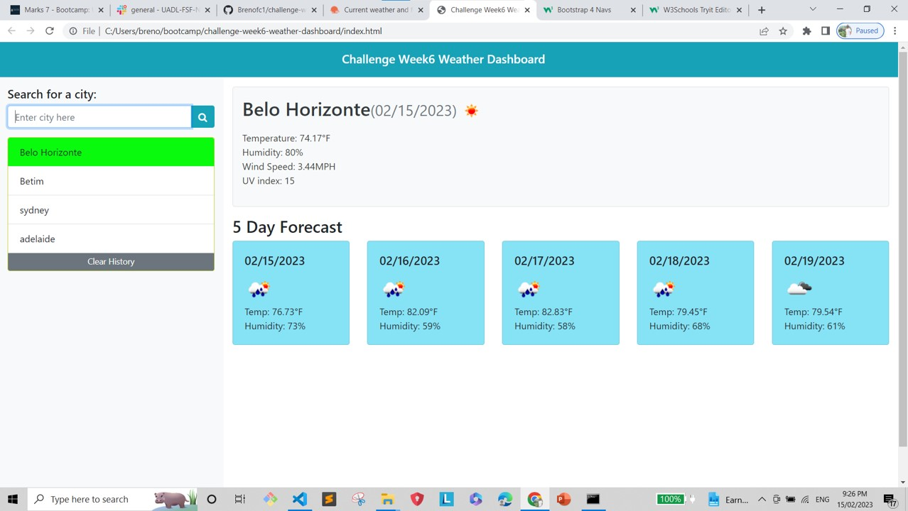

# challenge-week6-weather-dashboard

# 06 Server-Side APIs: Weather Dashboard

# I want an app weather dashboard that;
# When I search for a desired city it shows me the current weather as temperature, humidity, wind speed, UV index;
# Then it shows too the 5 days forecast;
# When I search for another city it shows me the weather, but keep the previous searched city on record in cause I want to check it again;
# When I refresh the page, all cities should be recorded;
# Then, if I decide to clear the records, I can do it clicking in a button;
# It should be responsive if I want to open it in differents device.

# screen shot

 